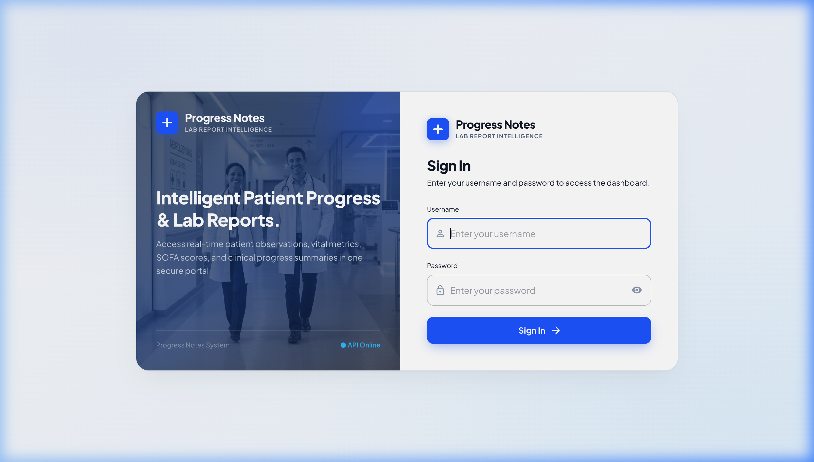
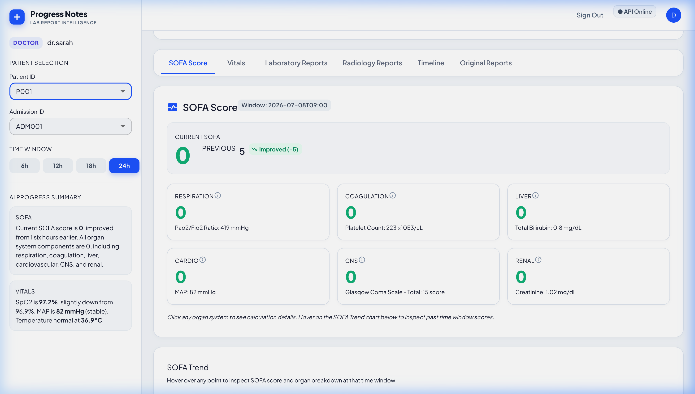
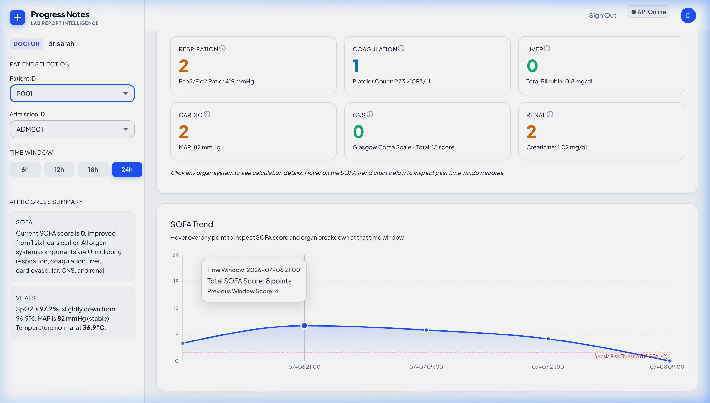
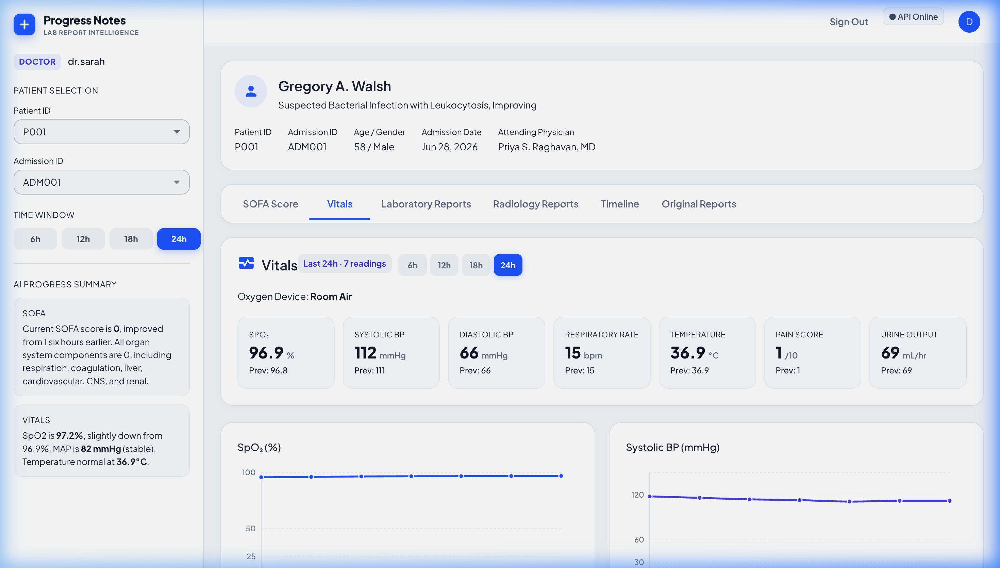
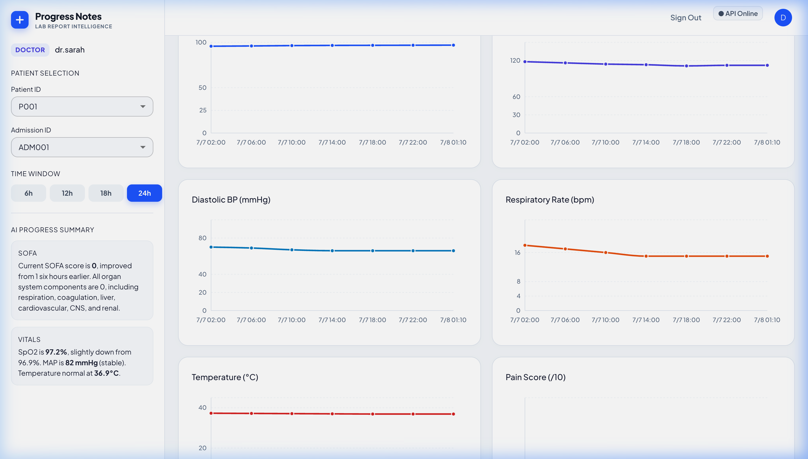
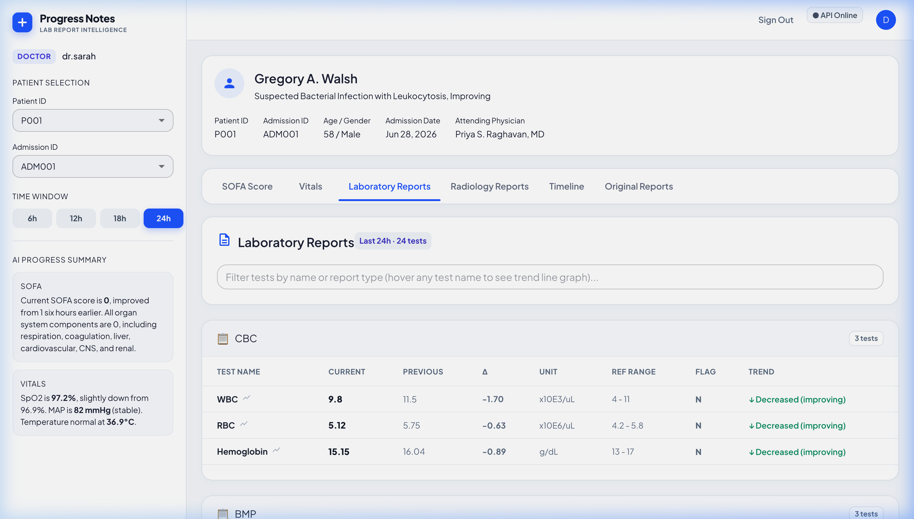
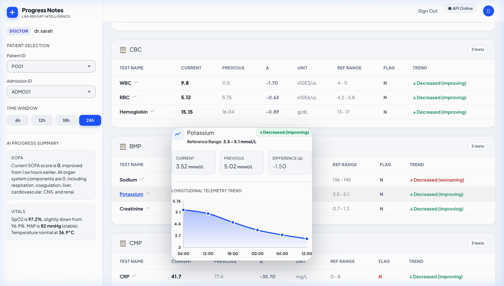
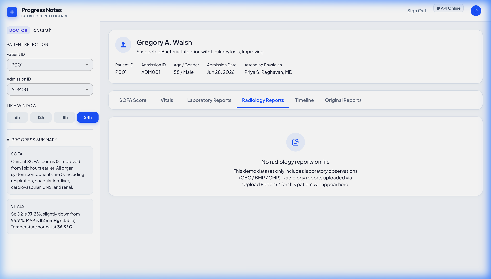
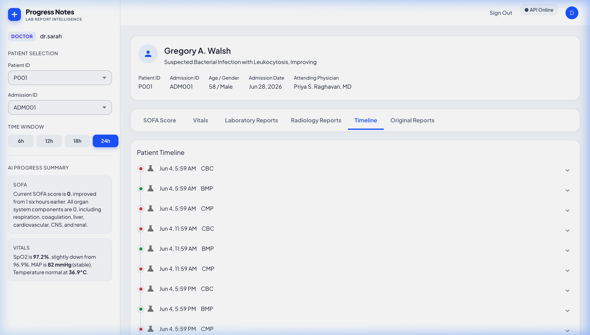
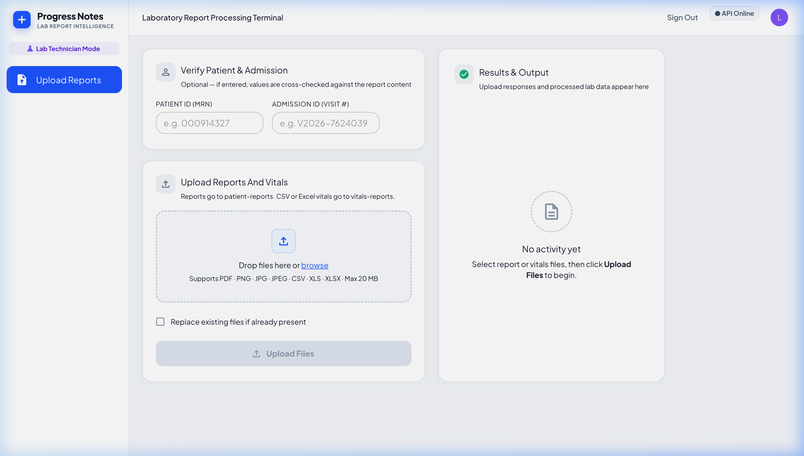

# Progress Notes — Complete UI Walkthrough & Backend Integration Package

Welcome to the **Progress Notes — Clinical Intelligence & Hospital EHR** complete walkthrough and backend integration package. This document contains all UI views, component screenshots, API endpoint specifications, and FastAPI integration blueprints for connecting the frontend to the backend.

---

## 📁 Repository Structure & Documentation
- **Root Documentation**:
  - [`API_SPECIFICATION.md`](./API_SPECIFICATION.md): Complete OpenAPI REST contracts, JSON request/response schemas.
  - [`FASTAPI_ROUTER_GUIDE.md`](./FASTAPI_ROUTER_GUIDE.md): FastAPI Phase 3 router blueprints (`app/api/phase3/router.py`).
  - [`FRONTEND_INTEGRATION_GUIDE.md`](./FRONTEND_INTEGRATION_GUIDE.md): Step-by-step connection, CORS, and runtime testing guide.
  - [`walkthrough.md`](./walkthrough.md): Visual walkthrough with embedded screenshots.
  - [`README.md`](./README.md): Project overview and quick start instructions.
- **Screenshots Directory**:
  - `screenshots/` containing all 10 high-resolution UI page and window captures.
- **Frontend Source Code**:
  - `src/api/`: Modular FastAPI service modules (`client.js`, `authService.js`, `patientService.js`, `vitalsService.js`, `labService.js`, `radiologyService.js`, `sofaService.js`, `summaryService.js`).
  - `src/components/`: Clinical Dashboard components, 3×2 SOFA grid, vitals charts, separated lab panels, hover trend popovers.
  - `src/context/AppContext.jsx`: Central state management with live backend hooks and safe offline fallbacks.

---

## 📸 Complete UI Screenshots & Window Showcase

### 1. Role-Based Authentication & Login Flow

* **Backend Endpoint**: `POST /auth/login`
* **Features**: Clinical role selection (`Doctor`, `Nurse`, `Lab Technician`), password validation, and session token generation.

---

### 2. Integrated Dashboard & SOFA Score (3×2 Grid)

* **Backend Endpoints**:
  * `GET /patients` -> Populates Patient ID dropdown (`P001`, `P002`, `P003`, `P004`).
  * `GET /patients/{patient_id}/admissions` -> Populates Admission ID dropdown (`ADM001`, `ADM002`).
  * `GET /patients/{patient_id}/admissions/{admission_id}/info` -> Populates patient details in dashboard.
  * `GET /patients/{patient_id}/admissions/{admission_id}/summary` -> Populates AI Progress Summary box.
  * `GET /patients/{patient_id}/admissions/{admission_id}/sofa/current` -> Current SOFA score, Previous baseline, and 6 organ sub-scores.
* **Layout**: 6 Organ System cards in a clean 3×2 grid (`Respiration`, `Coagulation`, `Liver`, `Cardio`, `CNS`, `Renal`).

---

### 3. SOFA Trend Real-Time Hover Synchronization

* **Backend Endpoint**: `GET /patients/{patient_id}/admissions/{admission_id}/sofa/history`
* **Interactive Hover**: Hovering over any point in the SOFA Trend chart dynamically updates the top KPI score, previous comparison, date window chip, and 6 organ sub-scores in real time!

---

### 4. Clinical Vitals Tab (Summary Metric Cards)

* **Backend Endpoint**: `GET /patients/{patient_id}/admissions/{admission_id}/vitals?window=24h`
* **Features**: Summary cards (`Heart Rate`, `Blood Pressure`, `SpO2`, `Resp Rate`, `Temperature`, `Urine Output`) with previous comparison deltas.

---

### 5. Clinical Vitals Telemetry Line Graphs

* **Backend Endpoint**: `GET /patients/{patient_id}/admissions/{admission_id}/vitals?window=24h`
* **Layout**: Spacious 2-column continuous telemetry curves with gradient fills and tooltips.

---

### 6. Laboratory Reports Tab (Separated Report Panels)

* **Backend Endpoint**: `GET /patients/{patient_id}/admissions/{admission_id}/lab-reports?window=24h`
* **Panels**: `CBC (Complete Blood Count)`, `BMP (Basic Metabolic Panel)`, `CMP & Hepatic Function`, `ABG (Arterial Blood Gas)`, `Hemodynamics`, `Inflammatory Panels`.
* **Columns**: `TEST NAME`, `CURRENT`, `PREVIOUS`, `Δ`, `UNIT`, `REF RANGE`, `FLAG`, `TREND`.

---

### 7. Laboratory Reports Hover / Click Trend Sparkline Popover

* Hovering on any test name opens a solid white interactive popover card displaying Current/Previous/Delta metrics and a 5-point telemetry trend curve.

---

### 8. Radiology Reports & Azure Blob Scans

* **Backend Endpoints**:
  * `GET /patients/{patient_id}/admissions/{admission_id}/radiology/images` (Scans from Azure Blob)
  * `GET /patients/{patient_id}/admissions/{admission_id}/radiology/reports` (Written findings & impressions)

---

### 9. Patient Clinical Timeline

* Longitudinal patient event tracking across admissions, labs, radiology, and vitals.

---

### 10. Lab Technician Upload Workstation (RBAC Isolation)

* **Backend Endpoint**: `POST /upload/report`
* **Security & RBAC**: Lab personnel only have access to the upload workstation and cannot access patient medical records.

---

## 🔗 How Backend Engineer Connects FastAPI
1. Put all Phase 3 endpoints in `app/api/phase3/` as detailed in [`FASTAPI_ROUTER_GUIDE.md`](./FASTAPI_ROUTER_GUIDE.md).
2. Start FastAPI with Uvicorn:
   ```bash
   uvicorn app.main:app --host 127.0.0.1 --port 8000 --reload
   ```
3. Start the React frontend:
   ```bash
   npm run dev
   ```
4. The frontend will automatically detect the backend and switch the top status pill to `● API Online`.
